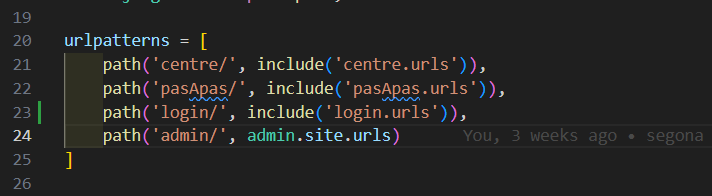
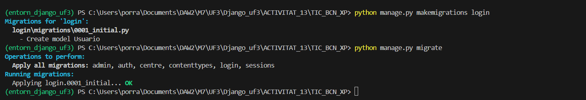
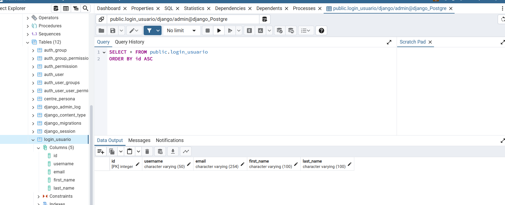

# ACTIVITAT 14

## Configuració Projecte

Treballa amb Postgre:

Templates:

Conectar amb la nova aplicació:

Afegir Urls nova aplicació:

## Crear la aplicació

Ordre per crear la aplicació:

## Crear model de l'aplicació

Ordenes Migrations

Taula login_usuario Postgre

## Documentació funcionalitats:

Enllaç video:
https://drive.google.com/file/d/1z4-mQP8Xy7GxoINcwDPXzRn8M467oXLI/view?usp=sharing